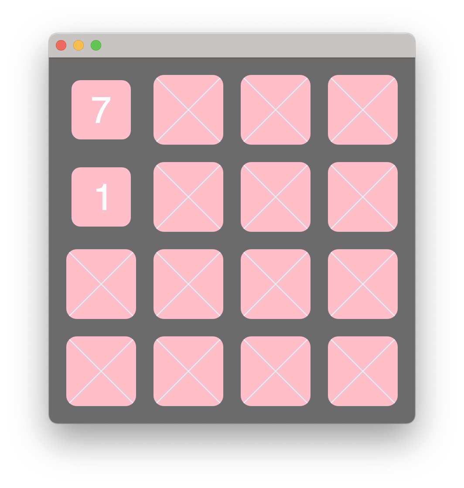

# Tutorials for Bloc

[](./LICENSE)
[](https://github.com/pharo-graphics/Tutorials/actions/workflows/test.yml)

This repository contains examples of [Bloc](https://github.com/pharo-graphics/Bloc).


## Installation

In [Pharo](https://pharo.org/download), evaluate:

```smalltalk
Metacello new
    baseline: 'BlocTutorials';
    repository: 'github://pharo-graphics/Tutorials:master/src';
    load
```


## Memory Game Tutorial

This is a Memory Card game. Please, find the code at the `Bloc-Memory` package.

The present code is the result of following the Bloc tutorial in [this booklet](https://files.pharo.org/books-pdfs/booklet-Bloc/2017-11-09-memorygame.pdf), with some little name adaptations.
The source code for such booklet can be found [here](https://github.com/SquareBracketAssociates/Booklet-BuildingMemoryGameWithBloc).



To start it, evaluate this code:

```smalltalk
"Create the game model and the Bloc element."
aGameElement := MGGameElement new
	memoryGame: MGGame withNumbers;
	yourself.

"The space represents the window"
space := BlSpace new.
space root addChild: aGameElement.

"Resize the space to the extent of the game board for the first time (this is known when the layout is applied)"
space root whenLayoutedDoOnce: [ space extent: aGameElement size ].

"Show the window"
space show.
```

By default, a OS "external" window will popup. It is also possible to popup a Morphic window. To do it, open "System Settings > Appearance > Bloc" and select "SDL2" in "Preferable Host".


## Reordering Examples

This example shows how to use drag-and-drop, and it's written using Bloc.

To execute it, evaluate the following code:

```smalltalk
BlPaneCreatingReorderingHandler new fittingColumnsExample
```

Thanks @StephanEggermont for the contribution.


## License

This code is licensed under the [MIT license](./LICENSE).
